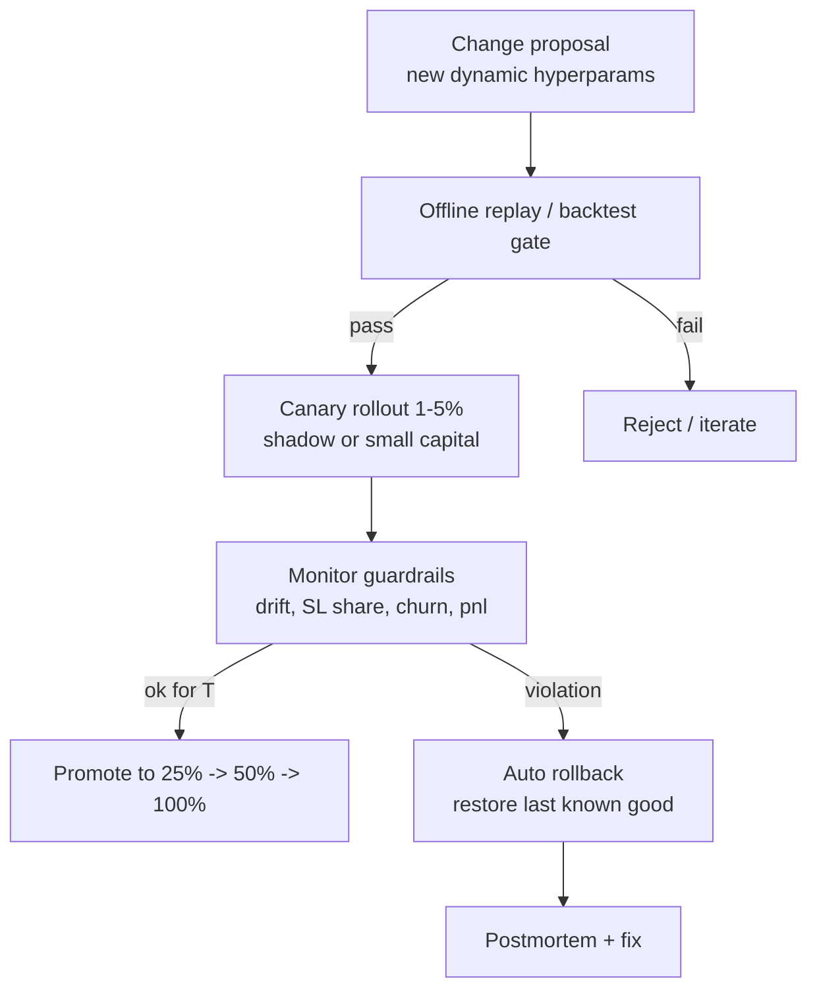

# Lead‑Lag HFT: корректная логика entry/exit и дизайн динамических робастных гиперпараметров

## Executive summary

Текущее ядро сигнала `spread_bps = max(bid_ask_bps, ask_bid_bps)` само по себе **не “неправильное”**, но оно **неполное как торговая логика**: `max()` может использоваться как *скалярный скор*, однако для корректного исполнения почти всегда нужно явно хранить **направление (какая ветка победила)** и управлять **фильтрами свежести/латентности**, иначе появляются систематические ложные входы и/или “перевёрнутая сторона” сделки. В HFT‑lead‑lag это особенно критично из‑за асинхронных тиков и разнородных timestamp‑ов (у Binance время по умолчанию в **ms**, но может быть и в **µs** через `timeUnit=MICROSECOND` citeturn4view0; у Gate в WS‑v4 поле `time` в запросах — **секунды** citeturn4view2, и отдельно в экосистеме есть поля миллисекундных времён вроде `nonce` при подписи citeturn4view1).

Использование перцентильных порогов вида **entry при `divergence >= p90`** и **exit при `convergence <= p50`** — практично как форма *авто‑нормализации под режим рынка* и *гистерезиса* (вход по “хвостам”, выход ближе к “норме”). Но важно:  
- **p90/p50 должны применяться к правильно определённым величинам**, согласованным со стороной сделки (long/short), иначе пороги будут “про не то”;  
- необходим **однозначный стандарт вычисления квантилей**, потому что разные пакеты по‑разному определяют квантиль на конечной выборке — это подробно разбирают Hyndman & Fan (1996) citeturn5view0turn1view0, а R и NumPy прямо ссылаются на эти определения и предлагают варианты (R “type 1..9”, NumPy “method”, включая `median_unbiased`/`normal_unbiased`) citeturn15view1turn15view0.

Для вашей второй цели (динамические робастные гиперпараметры вместо 7 статичных) надёжнее всего идти **ступенчато**:  
P0 — наблюдаемость + безопасность изменения параметров; P1 — адаптация порогов через перцентили + EWMA/exp‑decay; P2 — “learn‑to‑select” конфиги через bandit’ы; P3 — PBT / Bayesian optimization с неизвестными ограничениями и safe‑механиками. Основа “робастности” — не только умный алгоритм, но и **guardrails**: canary rollout, лимиты скорости изменения параметров, стоп‑лифты по риску. Иначе система начнёт оптимизировать шум.

---

## Допущения и invariants

Так как точное поведение кода не задано (вы просите treat as open), ниже фиксирую допущения, чтобы рекомендации были проверяемыми:

- **Сигнал:** вы вычисляете две “ветки” спреда на лучших bid/ask двух площадок и сравниваете их через `max()`; неизвестно, сохраняется ли при этом “победившая ветка” как направление.  
- **Исполнение:** неизвестно, торгуете ли вы на одной площадке (а вторую используете как “лидера/хеджа”), или только “теневой трейдинг” на одной книге. Поэтому ниже я формулирую entry/exit в терминах *направления* и *того, на какой книге вы реально исполняетесь*.  
- **Время:** вы нормализуете timestamps к ms и используете `drift_ms = local_ts_ms - exchange_ts_ms` с guard `|drift_ms| > 30_000 → drop`. На практике крайне важно, что биржевые timestamp‑поля реально бывают разной точности и семантики (Binance ms ↔ µs citeturn4view0; Gate WS‑v4 `time` в секундах citeturn4view2).  
- **Окна и cadence:** окна 1h/6h/24h и ребаланс 2 минуты (сейчас event‑driven). Для динамики параметров это значит: параметры логичнее пересчитывать дискретно (например, каждые 2 минуты) и применять “плавно” (slew‑rate).  
- **Малые выборки:** portfolio eligibility начинается с `closed_trades > 5` и `useful_winrate >= 0.3`. Это зона большой статистической неопределённости → требуется стабилизация оценок.

Отмечу отдельно: регуляторные требования MiFID II к синхронизации бизнес‑часов подчёркивают, что корректный порядок событий и аудит‑трейл опираются на **UTC‑синхронизацию и контролируемую погрешность** citeturn2view0turn16view0. В крипто это не “обязаловка” как у ESMA, но как инженерный принцип для HFT это крайне показательно: сравнение событий между источниками времени без дисциплины времени порождает систематические артефакты.

---

## Lead‑lag сигнал: `max()` по направлениям против перцентильных порогов

### Что именно делает `max(bid_ask_bps, ask_bid_bps)` и где ломается смысл

Пусть `spread(a, b) = ((a - b)/b)*10_000` (bps). Тогда две ветки:

- `edge_long = spread(leader_bid, lagger_ask)` — “можно купить lagger по ask и (гипотетически) продать leader по bid”  
- `edge_short = spread(lagger_bid, leader_ask)` — “можно продать lagger по bid и (гипотетически) купить leader по ask”

Текущий скор:  
`edge = max(edge_long, edge_short)`

**Плюсы такого ядра (если всё реализовано аккуратно):** вы уже используете *bid/ask*, то есть входной скор частично учитывает транзакционные издержки “пересечения спреда” (в отличие от mid‑mid). Для HFT это здоровая база.

**Типовой провал:** если дальше по pipeline теряется информация о том, *какая ветка дала `max`*, то `edge` становится “направление‑зависимой величиной без направления”. Тогда возможны ошибки класса:
- вход в неверную сторону;  
- неконсистентные exit‑правила (например, exit считается по метрике, не соответствующей входной ветке).

**Минимально корректный паттерн:** `max()` допустим, но только если он возвращает `(edge_value, direction)`.

Понимая, что ваш код “не указан”, ниже сразу даю эталонный псевдокод.

```text
edge_long  = spread(leader.bid, lagger.ask)   # buy lagger, sell leader (conceptually)
edge_short = spread(lagger.bid, leader.ask)   # sell lagger, buy leader (conceptually)

if edge_long >= edge_short:
    edge = edge_long
    dir  = LONG_LAGGER
else:
    edge = edge_short
    dir  = SHORT_LAGGER
```

### Почему перцентильные пороги часто лучше “голого” порога в bps

Статический порог `edge >= min_entry_spread_bps` не учитывает, что распределение `edge` (шум книги, волатильность, микроструктура, ликвидность) меняется. В спокойном рынке фиксированный порог может быть “слишком высоким” (мало сделок), а в турбулентном — “слишком низким” (много ложных входов).

Перцентильный порог делает нормализацию автоматически: входите, когда сигнал — в хвосте относительно текущего режима.

Ключевой момент: **перцентиль должен вычисляться на той же величине, по которой принимается решение**, иначе вы “нормализуете одно, а торгуете другое”.

### Правильная схема p90/p50 для entry/exit

Есть две распространённые корректные схемы. Выбор зависит от того, как именно вы определяете “convergence”.

#### Схема A: один показатель divergence, гистерезис p90/p50 на |divergence|

Самая простая, устойчивая и обычно достаточная, если ваша “convergence” по сути равна “уменьшению |divergence|”.

Определяем **signed divergence** (в bps) и работаем с модулем для порогов:

```text
div_bps = ((leader_mid - lagger_mid) / lagger_mid) * 10_000  # sign matters

q_entry = Q(|div_bps|, 0.90)   # p90 of absolute divergence
q_exit  = Q(|div_bps|, 0.50)   # p50 of absolute divergence (median)

entry if |div_bps| >= q_entry
exit  if |div_bps| <= q_exit
direction = sign(div_bps)  # + => long lagger, - => short lagger (conceptually)
```

**Почему это работает:** p90 задаёт “вход по экстремумам”, p50 — “выход по возвращению к типичному уровню”, то есть есть гистерезис, уменьшающий churn.

**Где может сломаться:** если вы исполняетесь не по mid, а по bid/ask, то divergence по mid может переоценивать реальную исполнимую прибыльность. В HFT‑реальности чаще хочется нормализовать именно “исполнимый edge”.

#### Схема B: отдельные показатели divergence (entry‑edge) и convergence (exit‑residual), p90 на вход, p50 на выход

Это ближе к вашему примеру (“divergence ≥ p90, convergence ≤ p50”) и особенно полезно, если вы явно моделируете “вход по пересечению одной стороны книги” и “выход по другой стороне”.

Для LONG_LAGGER:

```text
div_entry_bps = spread(leader.bid, lagger.ask)         # исполнимый edge на входе
conv_exit_bps = spread(leader.ask, lagger.bid)         # "остаток" расхождения на выходе (чем меньше, тем лучше)

q_entry = Q(div_entry_bps, 0.90)     # high tail of entry edge
q_exit  = Q(conv_exit_bps, 0.50)     # median residual; exit when residual becomes "normal/small"

entry if div_entry_bps >= q_entry and div_entry_bps >= cost_bps + buffer_bps
exit  if conv_exit_bps <= q_exit   or timeouts/stop/guards
```

Для SHORT_LAGGER — симметрично (меняются пары bid/ask).

**Ключевые требования к корректности схемы B:**
- `div_entry_bps` должен быть **монотонен “в сторону выгодности”** (больше = лучше для входа этой стороны);  
- `conv_exit_bps` должен быть **монотонен “в сторону закрытия сигнала”** (меньше = ближе к конвергенции).  

Если ваши текущие `div/conv` формулы из runtime именно так устроены — p90/p50 по ним смысл имеют. Если “convergence” у вас имеет другой знак/смысл, p50 на нём может закрывать сделки слишком рано или слишком поздно.

### Примеры ложных входов и пропусков, включая эффект latency

#### Ложный вход из‑за потери направления при `max()`

Пусть (в bps) `edge_long = +6`, `edge_short = +1`, а `threshold=5`.

- `edge = max = 6` → сигнал есть.  
- Если направление не сохранено и стратегия по умолчанию “шортит” (или выбирает не ту ветку), то вы входите в сторону, где реальная “арбитражная геометрия” не поддерживает прибыль — получите высокий `early_stop_churn`.

Вывод: **`max()` обязан возвращать направление**.

#### Ложный вход из‑за асинхронных котировок (latency)

В lead‑lag самая частая проблема: вы видите расхождение, потому что один источник “запаздывает”, но к моменту вашего ордера он уже догоняет/перестраивает книгу.

Типовая инженерная защита (кроме перцентилей):
- **staleness‑filter:** использовать только пары котировок, если оба источника “свежие” по *local receive time* (например, разница ≤ X ms), иначе не генерировать сигнал;  
- **persistence‑filter:** требовать, чтобы `edge` держался выше порога не один тик, а минимум `T_persist_ms` или `N` обновлений.

Эти фильтры — не “математика ради математики”, а защита от ложных крайних значений из‑за рассинхронизации времени. А рассинхронизация — не теоретическая: сами API показывают, что timestamp‑поля могут быть разной точности (Binance ms/µs citeturn4view0, Gate `time` в секундах citeturn4view2). Если нормализация времени ошибётся на ×1000/÷1000, ваш drift‑guard начнёт работать не так, как ожидается.

---

## Квантили и перцентили в runtime: как применять p90/p50 корректно и воспроизводимо

### Почему важно “какой именно квантиль” на конечной выборке

На конечной выборке разные пакеты используют разные определения sample quantiles. Hyndman & Fan (1996) систематизируют эти варианты и показывают, что даже “обычный p90” может отличаться между реализациями citeturn5view0turn1view0.

Практическое следствие: если вы сравниваете/валидируете стратегии в Python vs Rust (или триал‑аналитика vs runtime), вам нужен **единый стандарт квантиля**.

Это удобно зафиксировать через существующие “семейства” H&F:

- В R функция `quantile(..., type=1..9)` прямо реализует девять методов Hyndman & Fan и документирует параметры `m` и интерполяцию между порядковыми статистиками citeturn15view1.  
- В NumPy `numpy.quantile(..., method=...)` перечисляет варианты, пронумерованные как в Hyndman & Fan, и явно говорит, что дефолт `linear` соответствует частному случаю уравнения из H&F citeturn15view0.

**Рекомендация для HFT runtime:** выберите один метод и используйте везде, где “p90/p50 участвуют в принятии решений”. Варианты:
- **H&F #7** (NumPy `method='linear'`, R `type=7`) — распространённый дефолт в софте citeturn15view0turn15view1.  
- **H&F #8** (NumPy `method='median_unbiased'`, R `type=8`) — R‑документация указывает, что H&F рекомендуют `type=8` как приблизительно median‑unbiased независимо от распределения citeturn15view1turn1view0.

В HFT важнее не “абсолютно лучший” метод, а **стабильность и воспроизводимость**. Поэтому: выбрали → покрыли тестами → зафиксировали.

### Как считать перцентили быстро и безопасно на больших потоках

Если вы для каждого символа считаете перцентили на потоке тиков за 1h/6h/24h, “хранить всё и сортировать” может стать дорогим.

Два классических подхода:

- **Детерминированные online‑квантили с гарантией ошибки**: Greenwald–Khanna (2001) дают алгоритм для ε‑аппроксимации квантилей с ограниченной памятью citeturn17search0.  
- **Скетчи для точных хвостов**: t‑digest (Dunning & Ertl) ориентирован на высокую точность в хвостах распределения при малом размере структуры citeturn17search5.

Для вашей схемы “вход по p90/p95/p99” хвостовая точность важна, так что t‑digest часто практичнее, если вычислительная стоимость и инженерная сложность приемлемы.

### Как именно применять p90/p50 в entry/exit без логических ловушек

Набор правил, который обычно даёт устойчивую динамику:

1) **Перцентили считать на “нормализованной и отфильтрованной” величине**: перед добавлением в окно выбросить наблюдения, которые не прошли drift/staleness‑filters. Если нет такого фильтра, перцентили “запоминают” артефакты рассинхронизации.

2) **Entry‑порог — всегда “верхний хвост” плюс затраты**:

```text
thr_entry = max( Q(edge, 0.90), cost_bps + buffer_bps )
enter if edge >= thr_entry
```

3) **Exit‑порог — это гистерезис**, и p50 делает смысл, если exit‑метрика монотонна “к закрытию сигнала”:
- если exit‑метрика — residual mispricing → `exit if residual <= Q(residual, 0.50)`;  
- если вы используете ту же метрику, что и для входа (`edge`) → `exit if edge <= Q(edge, 0.50)` или даже `exit if edge <= 0` (более жёстко).

4) **Дополнительный safety‑exit**: timeout/stop‑loss/“слом сигнала” (например, смена лидера, распад корреляции). Это особенно важно, если `p50` закроет слишком поздно в резком режиме.

---

## Малые выборки: стабильность eligibility и ранжирования (Wilson, Bayesian smoothing, shrinkage)

Ваши правила portfolio eligibility (`closed_trades > 5`, `useful_winrate >= 0.3`) запускаются при маленьком `n`. На таких `n` доля побед крайне шумная, и “top‑5 shortlist” будет легко заполняться случайными всплесками.

Ниже — три метода, которые можно внедрить без “тяжёлого ML” и которые сильно улучшают устойчивость.

### Wilson score lower bound вместо сырой доли побед

Wilson (1927) выводит score‑интервал для биномиальной вероятности citeturn11view1; в прикладных рекомендациях он широко используется как устойчивый вариант для малых выборок, и NIST прямо приводит формулы и отмечает, что метод не “ломается” на малых `n`/крайних `p` citeturn9view1. Agresti & Coull (1998) также обсуждают преимущества score‑подхода и связь с “add two successes and two failures” эвристикой citeturn13view0turn13view2.

Обозначим:
- `n = closed_trades`
- `k = profitable_trades`
- `p_hat = k/n`
- `z` — квантиль нормального распределения (например, 1.96 для 95%)

Тогда **нижняя граница Wilson**:

```text
wilson_LB =
  ( p_hat + z^2/(2n) - z * sqrt( (p_hat*(1-p_hat) + z^2/(4n)) / n ) )
  / ( 1 + z^2/n )
```

Как применять в вашем tuple‑ranking:
- заменить `useful_winrate` на `wilson_LB(useful_winrate)` как первый ключ ранжирования;  
- eligibility: вместо `useful_winrate >= 0.30` использовать `wilson_LB >= 0.30` (жёстче, зато устойчивее при малом `n`).

Это резко снижает вероятность, что символ с “3 победы из 6” будет ранжироваться выше стабильного кандидата.

### Bayesian smoothing для winrate и stop‑loss share

Биномиальную долю можно сгладить через Beta‑prior:

```text
posterior_mean = (k + α) / (n + α + β)
```

Выбор приора:
- **Jeffreys prior**: α=β=0.5 (часто хорош в малых выборках)  
- **слабый симметричный**: α=β=1

Эта версия проще Wilson, но Wilson даёт “пессимистичный” bound (что в risk‑sensitive отборе часто лучше).

### Shrinkage для avg_pnl_pct и любых “средних” метрик

Для средних `avg_pnl_pct` (особенно при малом числе сделок) полезна простая линейная усадка к глобальному среднему:

```text
mu_shrunk = w * mu_symbol + (1 - w) * mu_global
w = n / (n + λ)
```

- `λ` — параметр силы усадки (например, эквивалент “ещё 20 виртуальных сделок”)  
- `mu_global` можно брать по всему shadow fleet или по группе схожих символов/ликвидности.

Интеграция в ваш tuple:
- использовать `mu_shrunk` вместо сырого `avg_pnl_pct`, или как отдельный ключ после winrate/pm_raw;  
- eligibility `avg_pnl_pct >= 0` заменить на `mu_shrunk >= 0` (или `mu_shrunk >= -ε`), чтобы не отсекать перспективные символы из‑за 1–2 шумных минусов.

---

## Динамические робастные гиперпараметры: алгоритмы, приоритеты и безопасный rollout

Ниже — набор методов “от простого к сложному”. Важное правило: **динамика параметров должна быть подчинена safety‑ограничениям** (лимиты риска, скорость изменения, авто‑rollback), иначе адаптация превращается в источник нестабильности.

### Методологический каркас: что именно адаптировать

Разумно делить параметры на три категории:

- **Safety параметры** (редко/никогда не адаптируются “на лету”): лимиты риска, максимальный допустимый спред, стоп‑кран по дрейфу времени, максимальная экспозиция, cooldown.  
- **Пороговые параметры сигнала** (лучшие кандидаты на адаптацию): `min_entry_spread_bps`, `spike_threshold_bps`, “persistence time”, фильтр свежести.  
- **Параметры управления сделкой** (адаптация осторожно): `max_hold_ms`, `stop_loss_bps`, `trailing_decay_ratio`, `target_ratio`.

Почему: пороги сигнала легко нормализуются под режим через перцентили; параметры управления сделкой сильно влияют на хвостовые риски — там нужна более жёсткая безопасность.

### Таблица сравнения методов адаптации

| method | math summary | telemetry needed | compute cost | safety complexity | recommended priority |
|---|---|---:|---:|---:|---|
| Percentile‑based thresholds | `thr = Q(metric, q)`; entry по `p90..p99`, exit по `p50..p70` | потоки `edge/divergence`, `residual/convergence`, лаг/свежесть | низкая–средняя (скетчи/окна) | средняя (slew‑rate, fallback) | **P1** |
| EWMA / exp‑decay for moments | `m_t = λ m_{t-1} + (1-λ)x_t` (аналог exp‑decay) | те же метрики + сглаженные моменты | низкая | низкая–средняя | **P1** |
| Multi‑armed bandit (UCB/TS) для выбора конфигов | выбор arm на основе reward; UCB даёт верхние оценки; TS — семплинг из постериора citeturn17search6turn18search3 | reward (`pnl`, риск‑штраф), счетчики, длительности | средняя | высокая (safe exploration) | **P2** |
| Population‑Based Training | популяция конфигов + exploit/explore, находит schedule гиперпараметров citeturn17search3turn17search7 | всё + инфраструктура популяции/мутаций | высокая | высокая | **P3** |
| Bayesian optimization (GP‑BO) | модель `f(θ)` через GP; выбор θ по acquisition citeturn18search0turn18search4 | офлайн/онлайн метрики качества на θ | высокая | высокая | **P3** |
| Constrained / Safe Bayesian optimization | BO с неизвестными ограничениями + safe region citeturn18search1turn18search2 | objective + constraint signals (DD, drawdown, SL share) | высокая | очень высокая | **P3** |

### Конкретные алгоритмы для вашей системы

#### Percentile‑адаптация порогов entry/exit

**Идея:** заменить статические `min_entry_spread_bps` и (часто) `spike_threshold_bps` на пороги, привязанные к распределению `edge` в окне (например 1h/6h/24h).

Математика (пример для entry‑edge):
```text
edge_t = max(edge_long_t, edge_short_t)   # но сохраняем dir
thr_entry_1h = Q(edge_{t-1h..t}, 0.90)
thr_entry_6h = Q(edge_{t-6h..t}, 0.90)

thr_entry = max(
  cost_bps + buffer_bps,
  w1*thr_entry_1h + w6*thr_entry_6h + w24*thr_entry_24h
)
```

Где веса можно подобрать эвристически (например, больше веса 1h для быстрого режима).

**Плюсы:** мгновенная нормализация под режим, простая интерпретация.  
**Минусы:** перцентили на хвостах требуют аккуратного подсчёта и защиты от выбросов/стейла.

**Требуемая телеметрия:** поток `edge`, staleness/lag, dropped_by_drift_guard.

**Безопасный rollout:**  
- canary на небольшой доле символов/конфигов;  
- ограничитель скорости изменения порога: `thr_t = clamp(thr_{t-1} ± Δ_max)`;  
- fallback: если в окне мало данных (`n < n_min`), использовать статический порог или более длинное окно.

#### EWMA/exp‑decay как “дешёвый” слой адаптации

RiskMetrics (1996) популяризировал EWMA‑модель для быстро реагирующих оценок изменчивости; документ описывает экспоненциальное взвешивание наблюдений и параметр decay factor `λ` citeturn22view0turn22view2turn21view0.

Для вас EWMA удобно применить не к “волатильности”, а к:
- средней `edge`,
- средней `pnl`,
- доле `stop_loss_share`,
- оценке “типичной длительности схождения” (half‑life).

Пример:
```text
m_edge_t = λ * m_edge_{t-1} + (1-λ) * edge_t
```

EWMA не заменяет p90/p50, но хорошо работает как **стабилизатор**: если перцентили скачут, EWMA‑слой может ограничить реакцию.

#### Multi‑armed bandit для выбора конфигов (shadow fleet → актив)

Если у вас 7 статичных параметров порождают множество конфигураций, можно трактовать каждую конфигурацию как “arm” и выбирать активные конфиги онлайн.

Два базовых семейства:
- **UCB‑подход** (Auer, Cesa‑Bianchi, Fischer 2002) — выбирает arm с максимальной верхней доверительной оценкой citeturn17search6.  
- **Thompson Sampling** (Thompson 1933) — семплирует из постериора и выбирает максимум citeturn18search3.

**Ключевая инженерная часть — reward‑функция и безопасность.** Пример reward за эпизод/период:
```text
reward = pnl_pct - κ1 * stop_loss_share - κ2 * early_stop_churn - κ3 * drawdown_proxy
```

**Safe‑вариант bandit:** запретить “исследовать” arm, который нарушает hard constraints (например, `stop_loss_share > 55%` как в вашем gate), и добавлять “conservative” ограничение на долю трафика, которую можно отдавать экспериментам.

Compute cost: средний (хранить статистики по arms), safety complexity: высокая.

#### Population‑Based Training как “консервативная эволюция расписаний”

PBT (Jaderberg et al., 2017) описывает оптимизацию *не одной фиксированной настройки*, а schedule гиперпараметров во времени — популяция моделей периодически “копирует лучших” и мутирует гиперпараметры citeturn17search3turn17search7.

Для HFT‑lead‑lag прямое PBT на реальном капитале опасно. Но как backtest/replay‑инструмент и как shadow‑fleet “эволюция конфигов” — это сильный P3‑кандидат.

#### Bayesian optimization и safe/constrained BO

Snoek et al. (2012) популяризировали GP‑Bayesian optimization для “чёрного ящика” гиперпараметров citeturn18search0turn18search4. Для реальных систем важно учитывать ограничения: Gelbart et al. (2014) рассматривают BO с неизвестными ограничениями citeturn18search1turn18search5. SafeOpt‑линия (Sui et al., 2015) предлагает безопасную оптимизацию с расширением безопасной области на основе confidence bounds citeturn18search2.

Для вашего runtime это почти наверняка **P3**:
- высокие требования к телеметрии и воспроизводимости,
- сложная safety‑логика,
- опасность “переобучения на коротком горизонте”.

### Где “встраиваются” перцентили и динамические параметры

```mermaid
flowchart TD
  A[Market Data WS<br/>Binance/Gate] --> B[Normalize timestamps to ms<br/>drift guard |drift|<=30s]
  B --> C[Build quotes: bid/ask/mid<br/>staleness & freshness filters]
  C --> D[Compute directional edges<br/>edge_long, edge_short<br/>dir = argmax]
  D --> E[Quantile/EWMA stats per window<br/>1h/6h/24h]
  E --> F[Dynamic params<br/>thr_entry(p90), thr_exit(p50), hold/SL suggestions]
  F --> G[Signal decision<br/>enter/exit + guards]
  G --> H[Shadow trader execution<br/>PnL, reasons]
  H --> I[Shadow fleet & portfolio stats<br/>eligibility, ranking]
  I --> E
```

---

## Наблюдаемость, диагностика и тестирование

Динамические параметры без сильной наблюдаемости почти гарантированно превращаются в “магические числа, которые сами себя меняют”. Ниже — набор проверок, которые прямо валидируют ваши 2 цели.

### Метрики, которые нужно строить и где ставить алерты

**Time & data quality**
- `drift_ms` по каждой бирже: p50/p90/p99, доля выбрасываний `|drift|>30_000`. Если резко растёт — вероятен unit‑bug или проблемы источника времени. (Сама возможность смены точности timestamps у Binance через `timeUnit` делает такие проверки обязательными citeturn4view0; у Gate разные поля могут быть в секундах/мс citeturn4view2turn4view1.)  
- `staleness_ms` (разница local receive times между источниками для пары котировок). Алерт, если медиана растёт или хвосты растут (симптом деградации коннекта).

**Signal integrity**
- `edge_long`, `edge_short`, выбранный `dir`, `edge=max`, плюс `thr_entry` и `thr_exit`.  
- доля входов, где `edge` был выше порога только один тик (симптом необходимости persistence‑filter).  
- “время жизни сигнала”: от entry до пересечения exit‑условия.

**Trade outcomes**
- `early_stop_churn` доля (в вашем определении) + доля stop‑loss из всех выходов.  
- `avg_catchup_pct`, `avg_catchup_lag_ms` (из вашего KPI набора) в разрезе конфигов и символов.

**Portfolio stability**
- churn символов в слотах A/B на ребалансе (сколько замен на цикл).  
- доля кандидатов, прошедших eligibility при `n` близком к минимуму (плохой признак нестабильного ранжирования).

### Юнит‑ и интеграционные тесты

**Юнит‑тесты математики**
- Квантиль: в тестовом наборе данных сравнить реализацию Rust с эталоном (например NumPy `method='linear'` или `median_unbiased`) так, чтобы выбранный метод соответствовал H&F определению citeturn15view0turn5view0.  
- Wilson LB: проверить формулу на крайних случаях (k=0, k=n, малые n) и сравнить с формулами NIST citeturn9view1 и происхождением score‑подхода у Wilson citeturn11view1.

**Юнит‑тесты времени**
- Нормализация s/ms/µs/ns: тесты на искусственных timestamp‑ах, включая gate‑`time` в секундах citeturn4view2 и binance ms/µs citeturn4view0.

**Интеграционные тесты поведения**
- Replay на исторических данных: воспроизвести последовательность котировок и убедиться, что при одинаковом входном потоке decisions детерминированы (особенно если rebalance event‑driven).  
- Canary‑test: включить динамические пороги только на 1–5% символов и сравнить распределения `early_stop_churn`, `stop_loss_share`, `avg_trade_pct` с контролем.

---

## Роадмап внедрения P0–P3 с критериями приёмки

### P0

**Deliverables (effort: small–medium)**
- Сделать `edge` не просто числом, а структурой `{edge_bps, direction, components}`; логировать обе ветки и выбранную.  
- Ввести `freshness/staleness` фильтр и метрики времени: drift‑распределения, доля dropped событий.  
- Ввести инфраструктуру безопасного изменения параметров: versioned params, canary routing, авто‑rollback.

**Acceptance criteria**
- Нулевая неоднозначность направления в логах и state.  
- Доля dropped по drift‑guard стабильно низкая и объяснимая; нет “массовых выбросов” после релизов.  
- Canary rollout + rollback работает процедурно (runbook).

### P1

**Deliverables (effort: medium)**
- Внедрить percentile‑based `thr_entry/exit` для `edge` или `(divergence, convergence)` по схеме A или B.  
- Зафиксировать метод квантиля (H&F #7 или #8) и покрыть тестами citeturn15view0turn15view1turn5view0.  
- Внедрить Wilson LB или Bayesian smoothing для winrate в portfolio eligibility/ranking citeturn9view1turn11view1turn13view2.

**Acceptance criteria**
- Снижение `early_stop_churn` (например, −20% относительно контроля) без ухудшения `avg_trade_pct`.  
- Снижение churn кандидатов/символов в портфеле при сохранении или улучшении общего `avg_pnl_pct`.  
- Устойчивость порогов: `thr_entry` не “пилит” на каждом цикле, есть ограничение скорости изменения.

### P2

**Deliverables (effort: medium–large)**
- Bandit‑слой выбора конфигов внутри shadow fleet: UCB/Thompson с reward, учитывающим риск‑штрафы citeturn17search6turn18search3.  
- Safe‑exploration: лимит доли трафика на exploration, hard constraints по stop‑loss share и др.  
- Перевод rebalance cadence к детерминированному scheduler (2 минуты) — иначе адаптивность будет зависеть от плотности тиков.

**Acceptance criteria**
- Конвергенция к небольшому числу “живых” конфигов без роста tail‑рисков (stop‑loss share, drawdown proxy).  
- Стабильный ребаланс каждые ~2 минуты независимо от потока тиков.

### P3

**Deliverables (effort: large)**
- PBT в shadow‑режиме для поиска schedules параметров citeturn17search3turn17search7.  
- BO‑оптимизация параметров на offline replay/backtest, затем constrained/safe BO для ограниченного online применения citeturn18search0turn18search1turn18search2.  
- Полный e2e контур: “гонка → действие” (если это в вашем target‑state), включая policy money‑rebalance, но только после стабилизации сигнала.

**Acceptance criteria**
- В offline/replay BO/PBT даёт устойчивый прирост KPI на out‑of‑sample сегментах (не только на тренировочном окне).  
- Онлайн safe‑слой гарантирует непревышение риск‑лимитов и авто‑rollback при деградации.

---



**Итог по вашим двум вопросам в одном предложении:** оставлять “ядро” как `max()` можно, но только как *скор с направлением* и с нормализацией/гистерезисом; p90/p50 — хороший следующий шаг, если вы стандартизируете квантиль и привяжете пороги к корректно определённым divergence/convergence; динамические гиперпараметры желательно внедрять по P0→P3 лестнице с жёсткими safety‑процедурами и стабилизацией малых выборок через Wilson/Bayes/shrinkage.